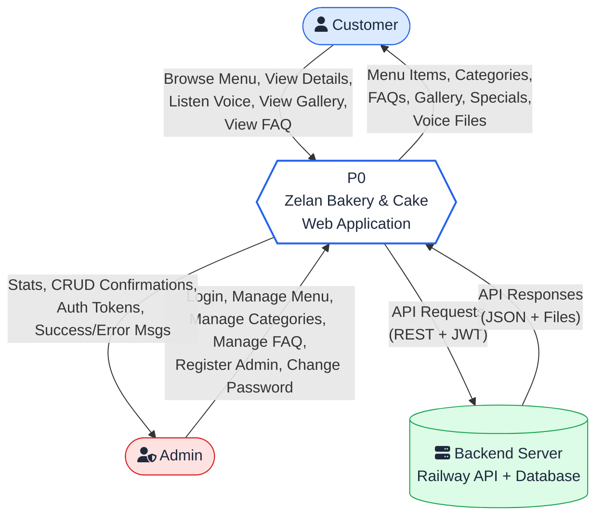
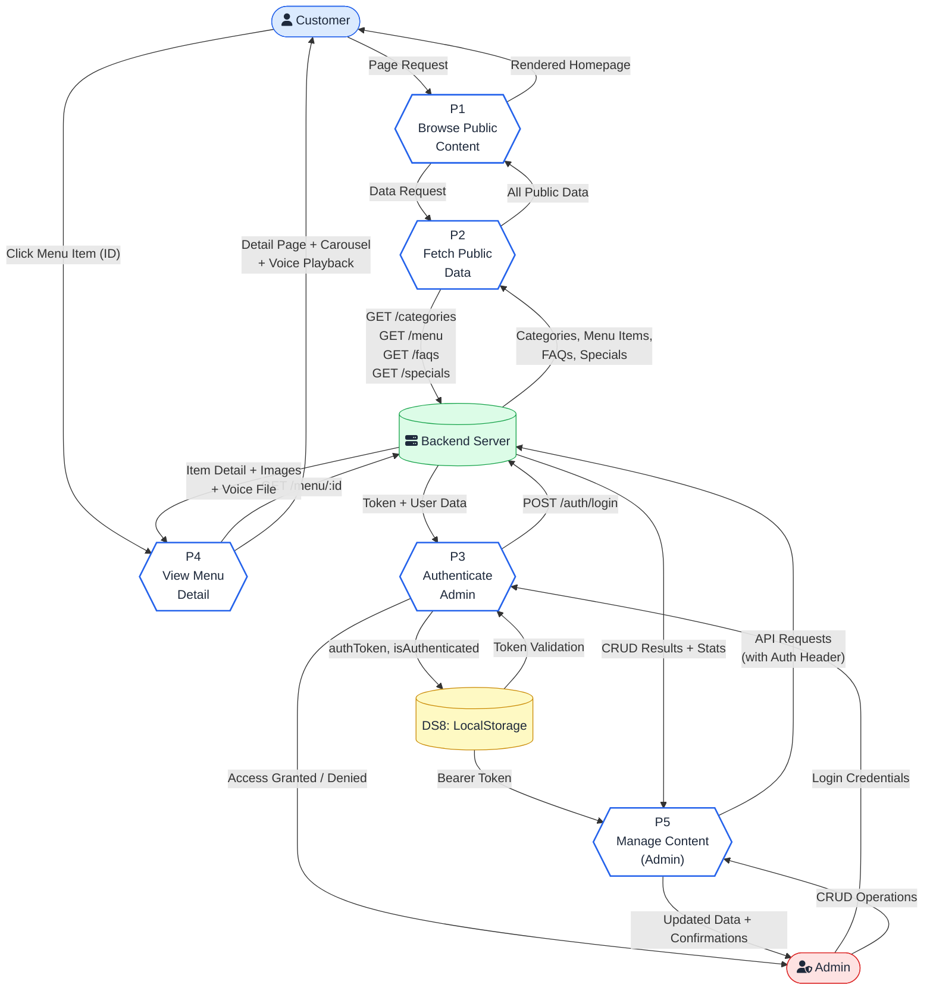
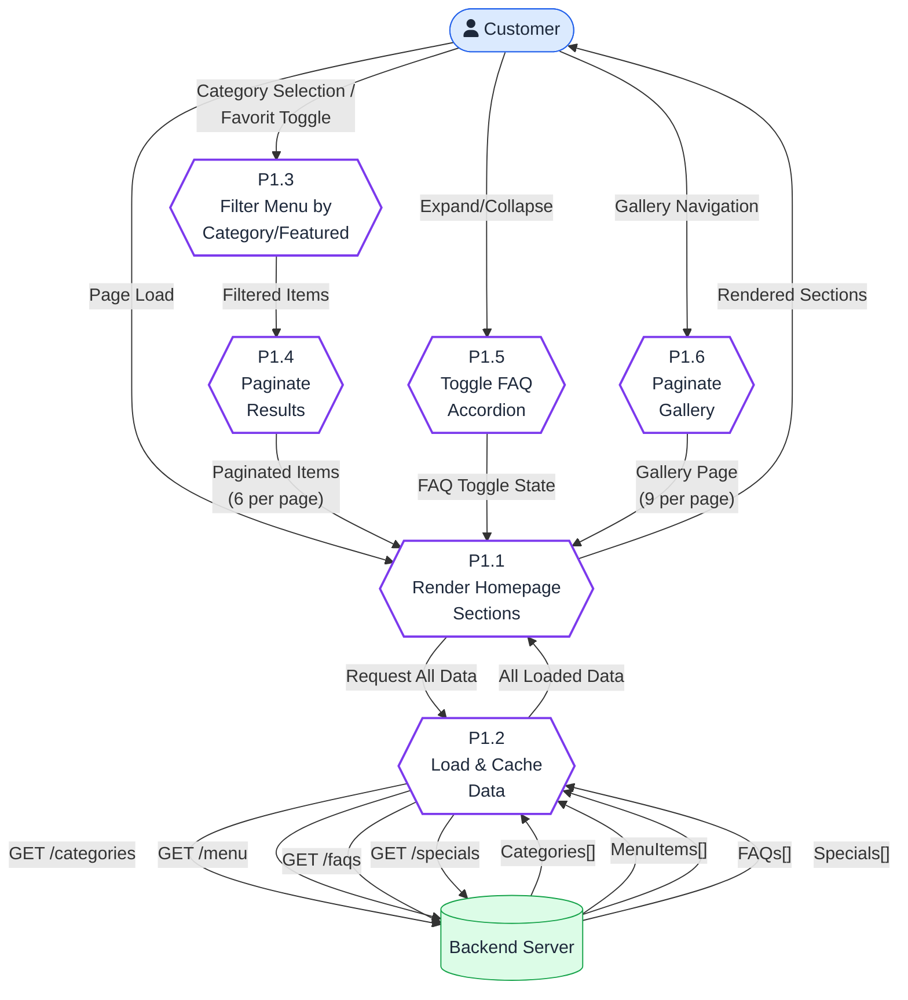
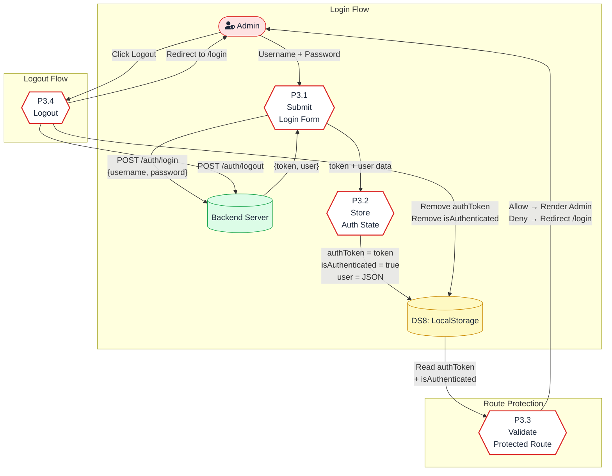
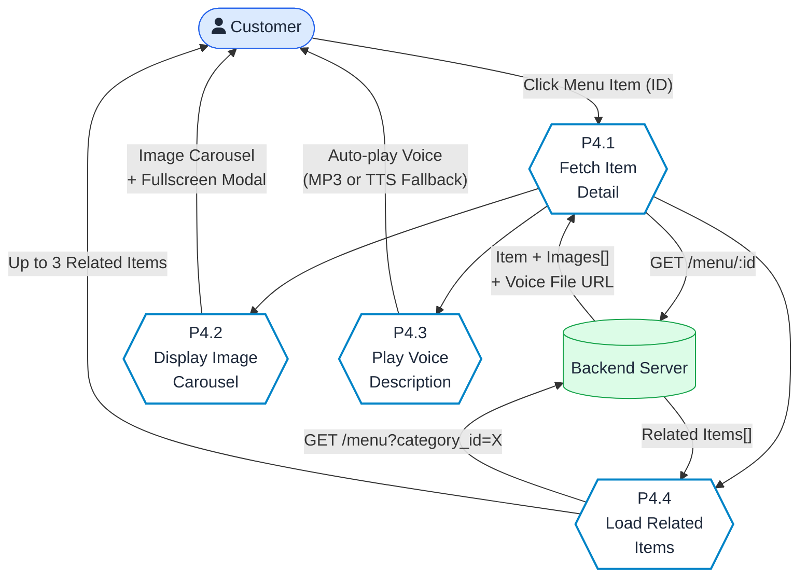
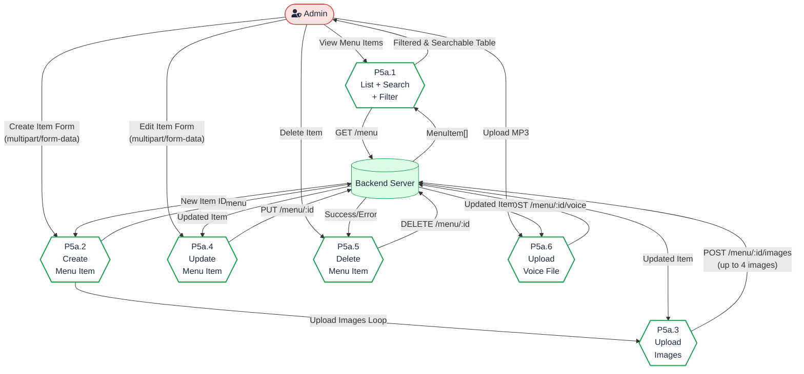
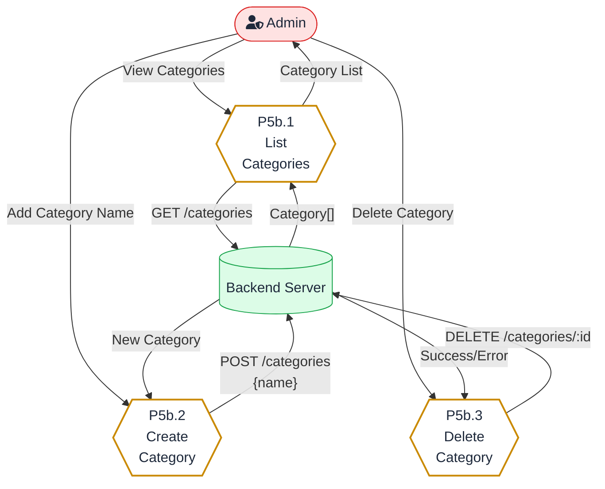
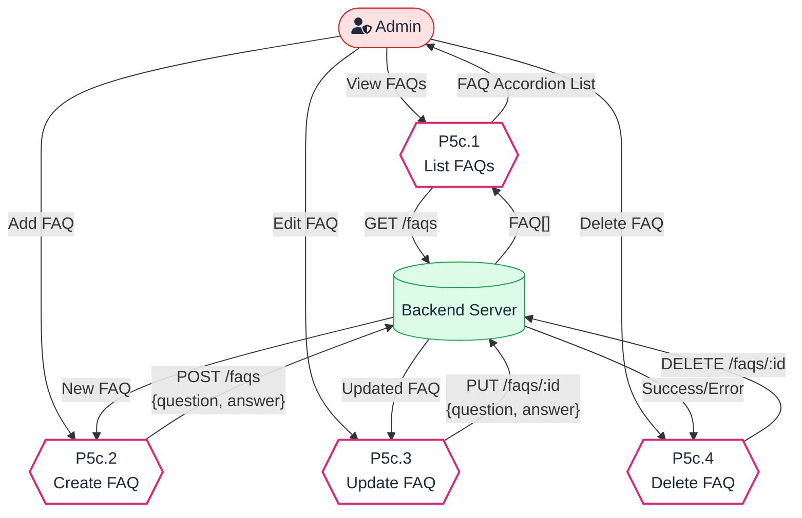
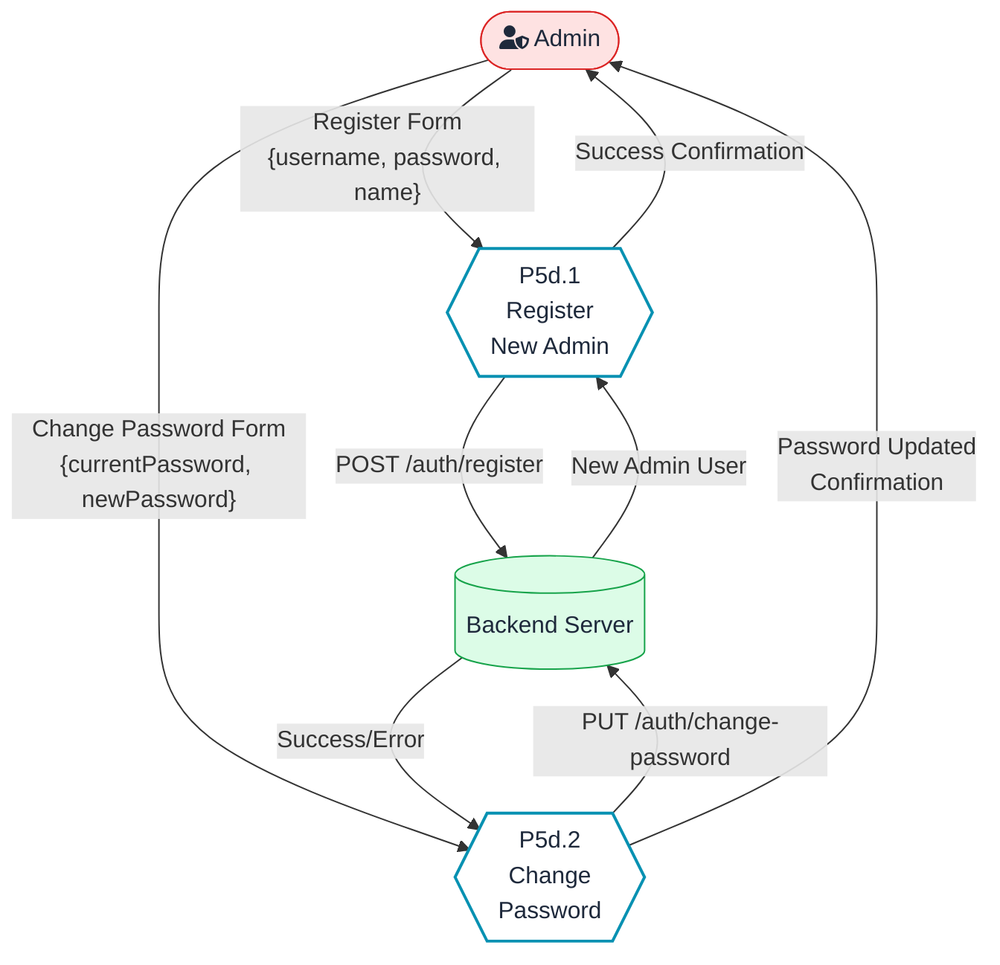

# Data Flow Diagram (DFD) Document
## Zelan Bakery & Cake - Web Application

**Version:** 1.0
**Date:** February 11, 2026
**Application:** Zelan Bakery & Cake Website
**Tech Stack:** React 18 + Vite + Axios
**Backend API:** https://zelanbe-production.up.railway.app

---

## Table of Contents

1. [External Entities](#1-external-entities)
2. [Data Stores](#2-data-stores)
3. [Context Diagram (Level 0)](#3-context-diagram-level-0)
4. [Level 1 DFD](#4-level-1-dfd)
5. [Level 2 DFD - Process Decomposition](#5-level-2-dfd---process-decomposition)
6. [Data Dictionary](#6-data-dictionary)
7. [API Endpoint Mapping](#7-api-endpoint-mapping)

---

## 1. External Entities

| ID   | Entity          | Description                                                    |
|------|-----------------|----------------------------------------------------------------|
| E1   | Customer        | Public user who browses the menu, views item details, and contacts the bakery |
| E2   | Admin           | Authenticated user who manages menu items, categories, FAQs, and other admin users |
| E3   | Backend Server  | REST API server hosted on Railway (zelanbe-production.up.railway.app) |

---

## 2. Data Stores

| ID   | Data Store         | Description                                          |
|------|--------------------|------------------------------------------------------|
| DS1  | Menu Items DB      | Stores menu items with images, prices, voice files   |
| DS2  | Categories DB      | Stores menu categories                               |
| DS3  | FAQs DB            | Stores frequently asked questions and answers         |
| DS4  | Gallery DB         | Stores gallery images                                |
| DS5  | Specials DB        | Stores promotional/special items                     |
| DS6  | Admin Users DB     | Stores admin user credentials and profiles           |
| DS7  | File Storage       | Stores uploaded images and voice (MP3) files         |
| DS8  | LocalStorage       | Browser localStorage for auth token, user session    |

---

## 3. Context Diagram (Level 0)

---

## 4. Level 1 DFD

### Level 1 Process Descriptions

| Process | Name                  | Description                                                                              |
|---------|-----------------------|------------------------------------------------------------------------------------------|
| P1      | Browse Public Content | Customer browses homepage: menu with category filtering, gallery, FAQ, specials, maps     |
| P2      | Fetch Public Data     | Retrieves all public data from backend API on page load (categories, menu, FAQs, gallery) |
| P3      | Authenticate Admin    | Handles admin login, token storage in localStorage, session validation, logout            |
| P4      | View Menu Detail      | Displays full menu item detail with image carousel, voice playback, and related items     |
| P5      | Manage Content (Admin)| Admin CRUD operations for menu items, categories, FAQs, and admin users                  |

---

## 5. Level 2 DFD - Process Decomposition

### 5.1 P1 - Browse Public Content

### 5.2 P3 - Authenticate Admin

### 5.3 P4 - View Menu Detail

### 5.4 P5a - Menu Item Management

### 5.5 P5b - Category Management

### 5.6 P5c - FAQ Management

### 5.7 P5d - Admin User Management

---

## 6. Data Dictionary

### 6.1 Menu Item

| Field             | Type          | Description                              |
|-------------------|---------------|------------------------------------------|
| id                | Integer       | Unique identifier                        |
| name              | String        | Item name                                |
| description       | String        | Item description                         |
| price             | Number        | Price in IDR                             |
| price_display     | String        | Formatted price (e.g., "55K")            |
| category_id       | Integer       | Foreign key to Category                  |
| category_name     | String        | Category name (populated by backend)     |
| image_url         | String/null   | Legacy single image URL                  |
| images            | Array         | Up to 4 images [{id, image_url, is_main}]|
| voice_file        | String/null   | Path to MP3 voice file                   |
| voice_description | String/null   | Text for TTS fallback                    |
| tag               | String/null   | Label (e.g., "Best Seller")              |
| is_featured       | Boolean       | Whether item is featured                 |
| unit              | String/null   | Unit of measurement (e.g., "pcs")        |

### 6.2 Category

| Field | Type    | Description        |
|-------|---------|--------------------|
| id    | Integer | Unique identifier  |
| name  | String  | Category name      |

### 6.3 FAQ

| Field    | Type    | Description        |
|----------|---------|--------------------|
| id       | Integer | Unique identifier  |
| question | String  | FAQ question       |
| answer   | String  | FAQ answer         |

### 6.4 Dashboard Statistics

| Field           | Type    | Description                      |
|-----------------|---------|----------------------------------|
| totalItems      | Integer | Total menu items count           |
| totalCategories | Integer | Total categories count           |
| featuredItems   | Integer | Featured menu items count        |
| voiceEnabled    | Integer | Items with voice (MP3 or text)   |

### 6.5 Auth Token (localStorage)

| Key              | Type   | Description                     |
|------------------|--------|---------------------------------|
| authToken        | String | JWT Bearer token                |
| isAuthenticated  | String | "true" or "false"               |
| user             | String | JSON stringified user object    |

---

## 7. API Endpoint Mapping

### Authentication

| Method | Endpoint              | Data Flow Direction | Data                                     |
|--------|-----------------------|---------------------|------------------------------------------|
| POST   | /auth/login           | E2 → E3 → DS6      | {username, password} → {token, user}     |
| POST   | /auth/logout          | E2 → E3             | Token invalidation                       |
| POST   | /auth/register        | E2 → E3 → DS6      | {username, password, name} → {user}      |
| PUT    | /auth/change-password | E2 → E3 → DS6      | {currentPassword, newPassword}           |

### Categories

| Method | Endpoint          | Data Flow Direction | Data                    |
|--------|-------------------|---------------------|-------------------------|
| GET    | /categories       | E3 → DS2 → App     | Category[]              |
| POST   | /categories       | E2 → E3 → DS2      | {name} → Category       |
| DELETE | /categories/:id   | E2 → E3 → DS2      | Deletion confirmation   |

### Menu Items

| Method | Endpoint                       | Data Flow Direction    | Data                          |
|--------|--------------------------------|------------------------|-------------------------------|
| GET    | /menu                          | E3 → DS1 → App        | MenuItem[]                    |
| GET    | /menu/by-category              | E3 → DS1 → App        | {category: MenuItem[]}        |
| GET    | /menu/:id                      | E3 → DS1 → App        | MenuItem (with images)        |
| POST   | /menu                          | E2 → E3 → DS1, DS7    | FormData → MenuItem           |
| PUT    | /menu/:id                      | E2 → E3 → DS1, DS7    | FormData → MenuItem           |
| DELETE | /menu/:id                      | E2 → E3 → DS1, DS7    | Deletion confirmation         |
| POST   | /menu/:id/voice                | E2 → E3 → DS7         | MP3 File → Updated MenuItem   |
| POST   | /menu/:id/images               | E2 → E3 → DS7         | Image File → Updated MenuItem |
| DELETE | /menu/:id/images/:imgId        | E2 → E3 → DS7         | Deletion confirmation         |
| PATCH  | /menu/:id/images/:imgId/main   | E2 → E3 → DS1         | Set main image flag           |

### FAQs

| Method | Endpoint    | Data Flow Direction | Data                  |
|--------|-------------|---------------------|-----------------------|
| GET    | /faqs       | E3 → DS3 → App     | FAQ[]                 |
| POST   | /faqs       | E2 → E3 → DS3      | {question, answer}    |
| PUT    | /faqs/:id   | E2 → E3 → DS3      | {question, answer}    |
| DELETE | /faqs/:id   | E2 → E3 → DS3      | Deletion confirmation |

### Specials

| Method | Endpoint      | Data Flow Direction | Data                  |
|--------|---------------|---------------------|-----------------------|
| GET    | /specials     | E3 → DS5 → App     | Special[]             |
| POST   | /specials     | E2 → E3 → DS5      | Special data          |
| PUT    | /specials/:id | E2 → E3 → DS5      | Special data          |
| DELETE | /specials/:id | E2 → E3 → DS5      | Deletion confirmation |

### Gallery

| Method | Endpoint      | Data Flow Direction | Data                  |
|--------|---------------|---------------------|-----------------------|
| GET    | /gallery      | E3 → DS4 → App     | GalleryItem[]         |
| POST   | /gallery      | E2 → E3 → DS4, DS7 | FormData              |
| PUT    | /gallery/:id  | E2 → E3 → DS4, DS7 | FormData              |
| DELETE | /gallery/:id  | E2 → E3 → DS4, DS7 | Deletion confirmation |

### Statistics

| Method | Endpoint | Data Flow Direction | Data             |
|--------|----------|---------------------|------------------|
| GET    | /stats   | E3 → DS1, DS2 → App| DashboardStats   |

---

## 8. Summary of All Data Flows

### Customer (Public) Flows

| #  | Flow                         | Source | Process               | Destination |
|----|------------------------------|--------|-----------------------|-------------|
| 1  | Browse Homepage              | E1     | P1 → P2 → E3         | E1          |
| 2  | Filter Menu by Category      | E1     | P1.3 (client-side)    | E1          |
| 3  | Filter Menu by Featured      | E1     | P1.3 (client-side)    | E1          |
| 4  | Paginate Menu Items          | E1     | P1.4 (client-side)    | E1          |
| 5  | View Menu Item Detail        | E1     | P4.1 → E3            | E1          |
| 6  | Browse Image Carousel        | E1     | P4.2 (client-side)    | E1          |
| 7  | Play Voice Description       | E1     | P4.3 → E3 (MP3/TTS)  | E1          |
| 8  | View Related Items           | E1     | P4.4 → E3            | E1          |
| 9  | Expand/Collapse FAQ          | E1     | P1.5 (client-side)    | E1          |
| 10 | Browse Gallery               | E1     | P1.6 (client-side)    | E1          |
| 11 | View Fullscreen Gallery Image| E1     | P1.6 (client-side)    | E1          |

### Admin Flows

| #  | Flow                        | Source | Process               | Destination |
|----|-----------------------------|--------|-----------------------|-------------|
| 12 | Login                       | E2     | P3.1 → E3 → P3.2     | DS8         |
| 13 | Route Protection Check      | DS8    | P3.3                  | E2          |
| 14 | Logout                      | E2     | P3.4 → E3            | DS8         |
| 15 | View Dashboard Stats        | E2     | P5 → E3              | E2          |
| 16 | List Menu Items             | E2     | P5a.1 → E3           | E2          |
| 17 | Search/Filter Menu Items    | E2     | P5a.1 (client-side)   | E2          |
| 18 | Create Menu Item            | E2     | P5a.2 → E3 → DS1     | E2          |
| 19 | Upload Item Images          | E2     | P5a.3 → E3 → DS7     | E2          |
| 20 | Update Menu Item            | E2     | P5a.4 → E3 → DS1     | E2          |
| 21 | Delete Menu Item            | E2     | P5a.5 → E3 → DS1     | E2          |
| 22 | Upload Voice File           | E2     | P5a.6 → E3 → DS7     | E2          |
| 23 | List Categories             | E2     | P5b.1 → E3 → DS2     | E2          |
| 24 | Create Category             | E2     | P5b.2 → E3 → DS2     | E2          |
| 25 | Delete Category             | E2     | P5b.3 → E3 → DS2     | E2          |
| 26 | List FAQs                   | E2     | P5c.1 → E3 → DS3     | E2          |
| 27 | Create FAQ                  | E2     | P5c.2 → E3 → DS3     | E2          |
| 28 | Update FAQ                  | E2     | P5c.3 → E3 → DS3     | E2          |
| 29 | Delete FAQ                  | E2     | P5c.4 → E3 → DS3     | E2          |
| 30 | Register New Admin          | E2     | P5d.1 → E3 → DS6     | E2          |
| 31 | Change Password             | E2     | P5d.2 → E3 → DS6     | E2          |

---

*Document generated for Zelan Bakery & Cake web application.*
